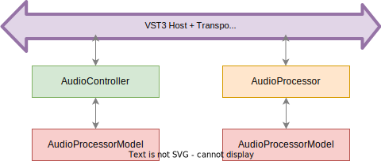
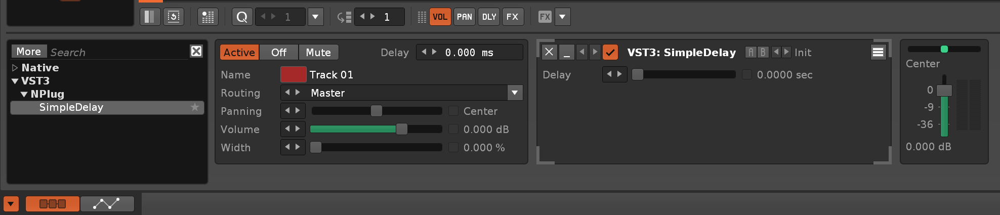
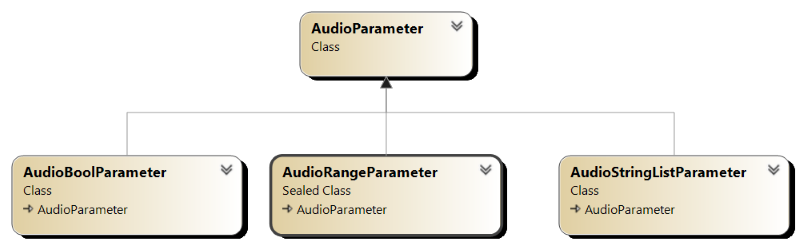

# NPlug User Guide

This is a small user guide to get you started with NPlug.

For more information about developing a VST3 plugin, please visit the official documentation at https://steinbergmedia.github.io/vst3_dev_portal/pages/

## Overview

NPlug is following the recommendation of the VST3 architecture and requires that you develop your plugin by separating 2 components




- The `AudioController` component is responsible to manipulate the data model of your VST3 and provides an optional UI. It allows the VST3 host to interact with your VST when automating your plugin parameters. It allows your UI to notify the VST3 host about parameter changes. All this interaction is running on the UI Thread.
- The `AudioProcessor` component is responsible to generate the audio (whether this is an effect plugin or an instruments) based on the data model. The data model is synchronized through the VST3 host.


The controller and processor should not share data directly (no static variables between them!) but instead should notify their changes through the model. Both the controller and processor maintain their own instance of the model, and changes are synchronized through the VST3 host.

NPlug provides the infrastructure to automatically synchronize the data model between the controller and the processor.

The `AudioController` and `AudioProcessor` implement some of the core NPlug VST interfaces:


## Getting Started

In this section, we will port the the C/C++ adelay sample from https://github.com/steinbergmedia/vst3_public_sdk/tree/master/samples/vst/adelay/source

This sample is available in `NPlug.SimpleDelay` in the [NPlug sample repository](https://github.com/xoofx/NPlug.Samples).

> **NOTICE**
> 
> This example is developed for the Windows platform as it is for now the easiest platform to work with for developing VST3 in .NET with NPlug.

### Step 0: Create a new C# project

Create a .NET7+ class library:

```
dotnet new classlib -n NPlug.SimpleDelay
```

Add NPlug to your project:

```
cd NPlug.SimpleDelay
dotnet add package NPlug
```

### Step 1: Create your model class

Create a class `SimpleDelayModel` that inherits from `NPlug.AudioProcessorModel` and add an `AudioParameter` called `Delay`:

```c#
namespace NPlug.SimpleDelay;

public class SimpleDelayModel : AudioProcessorModel
{
    public SimpleDelayModel() : base("NPlug.SimpleDelay")
    {
        AddByPassParameter();
        Delay = AddParameter(new AudioParameter("Delay", units: "sec", defaultNormalizedValue: 1.0));
    }

    public AudioParameter Delay { get; }
}
```

Notice that because we are developing a VST3 Effect, we are required to add the `ByPass` parameter.

### Step 2: Create your controller class

Create a class `SimpleDelayController` that inherits from `AudioController<TModel>` and by replacing `TModel` with `SimpleDelayModel` we just created.

We are also creating a new `Guid` static field associated with this controller.

```c#
namespace NPlug.SimpleDelay;

public class SimpleDelayController : AudioController<SimpleDelayModel>
{
    public static readonly Guid ClassId = new("484e783b-5f47-42f4-a19f-96c1fd42fb45");
}
```

The controller is very simple here because this sample does not have any UI and NPlug provides support for automatically synchronizing the model with the host.

### Step 3: Create your processor class

Create a class `SimpleDelayProcessor` that inherits from `AudioProcessor<TModel>` and by replacing `TModel` with `SimpleDelayModel` we just created.

The following code contains the full implementation of the processor. The `AudioProcessor` has several methods that can be overridden to implement the behavior. Mainly you need to:

- Initialize your plugin by overriding the `Initialize` method. In this method, you should define your input/output.
- Implement the `OnActivate` method to allocate your buffers required by your plugin.
- Implement the `ProcessMain` method to process the audio buffers and apply the plugin effect.

You will notice that in the `ProcessMain` method, we are accessing the `Model.Delay` variable. The Model instance is automatically synchronized with the controller.

Compare to the C++ version you will notice that we don't have to handle the serialization/deserialization of the parameters defined for our model. This is handled automatically by the `AudioProcessorModel` class. All parameters are efficiently serialized/deserialized as `double` float.

Similar to the controller, the processor provides also it's own `Guid` field to identify it (used by the plugin registration in the next section).

Notice that we are associating the processor with the controller by implementing the property `ControllerClassId` and we return the `Guid` of the controller defined previously.

```c#
namespace NPlug.SimpleDelay;

/// <summary>
/// Port of C/C++ adelay sample from https://github.com/steinbergmedia/vst3_public_sdk/tree/master/samples/vst/adelay/source
/// </summary>
public class SimpleDelayProcessor : AudioProcessor<SimpleDelayModel>
{
    private float[] _bufferLeft;
    private float[] _bufferRight;
    private int _bufferPosition;

    public static readonly Guid ClassId = new("7a130e07-004a-408d-a1d8-97b671f36ca1");

    public SimpleDelayProcessor() : base(AudioSampleSizeSupport.Float32)
    {
        _bufferLeft = Array.Empty<float>();
        _bufferRight = Array.Empty<float>();
    }

    public override Guid ControllerClassId => SimpleDelayController.ClassId;


    protected override bool Initialize(AudioHostApplication host)
    {
        AddAudioInput("AudioInput", SpeakerArrangement.SpeakerStereo);
        AddAudioOutput("AudioOutput", SpeakerArrangement.SpeakerStereo);
        return true;
    }

    protected override void OnActivate(bool isActive)
    {
        if (isActive)
        {
            var delayInSamples = (int)(ProcessSetupData.SampleRate * sizeof(float) + 0.5);
            _bufferLeft = GC.AllocateArray<float>(delayInSamples, true);
            _bufferRight = GC.AllocateArray<float>(delayInSamples, true);
            _bufferPosition = 0;
        }
        else
        {
            _bufferLeft = Array.Empty<float>();
            _bufferRight = Array.Empty<float>();
            _bufferPosition = 0;
        }
    }

    protected override void ProcessMain(in AudioProcessData data)
    {
        var delayInSamples = Math.Max(1, (int)(ProcessSetupData.SampleRate * Model.Delay.NormalizedValue));
        for (int channel = 0; channel < 2; channel++)
        {
            var inputChannel = data.Input[0].GetChannelSpanAsFloat32(ProcessSetupData, data, channel);
            var outputChannel = data.Output[0].GetChannelSpanAsFloat32(ProcessSetupData, data, channel);

            var sampleCount = data.SampleCount;
            var buffer = channel == 0 ? _bufferLeft : _bufferRight;
            var tempBufferPos = _bufferPosition;
            for (int sample = 0; sample < sampleCount; sample++)
            {
                var tempSample = inputChannel[sample];
                outputChannel[sample] = buffer[tempBufferPos];
                buffer[tempBufferPos] = tempSample;
                tempBufferPos++;
                if (tempBufferPos >= delayInSamples)
                {
                    tempBufferPos = 0;
                }
            }
        }

        _bufferPosition += data.SampleCount;
        while (_bufferPosition >= delayInSamples)
        {
            _bufferPosition -= delayInSamples;
        }
    }
}
```

### Step 4: Register your plugin class

We need to create a static class `SimpleDelayPlugin` that will have a module initializer method `ExportThisPlugin()` and create the associated `AudioPluginFactory`.

Notice that we are using the `Guid` of both the controller and processor to define our plugin.

Then we simply need to export our plugin by setting the factory instance `AudioPluginFactoryExporter.Instance`.

```c#
using System.Runtime.CompilerServices;

namespace NPlug.SimpleDelay;

public static class SimpleDelayPlugin
{
    public static AudioPluginFactory GetFactory()
    {
        var factory = new AudioPluginFactory(new("NPlug", "https://github.com/xoofx/NPlug", "no_reply@nplug.org"));
        factory.RegisterPlugin<SimpleDelayProcessor>(new(SimpleDelayProcessor.ClassId, "SimpleDelay", AudioProcessorCategory.Effect));
        factory.RegisterPlugin<SimpleDelayController>(new(SimpleDelayController.ClassId, "SimpleDelay Controller"));
        return factory;
    }

    [ModuleInitializer]
    internal static void ExportThisPlugin()
    {
        AudioPluginFactoryExporter.Instance = GetFactory();
    }
}
```

### Step 5: Compile your plugin for testing/debugging

If you build a debug version of your plugin with `dotnet build` you will get the following generated files in the `bin/Debug/net7.0` folder:

```
Mode                LastWriteTime         Length Name
----                -------------         ------ ----
-a---         05-Mar-23     12:06         454144   NPlug.dll
-a---         05-Mar-23     12:06         161332   NPlug.pdb
-a---         05-Mar-23     09:39            782   NPlug.SimpleDelay.deps.json
-a---         05-Mar-23     12:06           8192   NPlug.SimpleDelay.dll
-a---         05-Mar-23     12:06          12080   NPlug.SimpleDelay.pdb
-a---         05-Mar-23     09:39            349   NPlug.SimpleDelay.runtimeconfig.json
-a---         26-Feb-23     17:53         342016   NPlug.SimpleDelay.vst3
```

You then need to copy all these files to the official VST3 location for plugins on Windows: `C:\Program Files\Common Files\VST3`

You can load your favorite VST3 host. In our case, we are going to use [Renoise](https://www.renoise.com/).



> **NOTICE**
> 
> You will notice several files for this plugin. This is because we are using a debug setup without NativeAOT. In practice, the file `NPlug.SimpleDelay.vst3` is actually a generic native proxy that is going to load the .NET runtime in your VST host and instantiate your plugin by loading the `NPlug.SimpleDelay.dll` assembly.
> 
> This setup is easier to work with when you are developing your plugin.
> 
> Once you are ready, you can compile your plugin with NativeAOT.

### Step 6: Compile your plugin to native with NativeAOT

Once you want to publish your plugin, you can compile your plugin to native with NativeAOT:

```c#
dotnet publish -c Release -r win-x64 -p:PublishAot=true
```

This will generate the following file in this folder `NPlug.SimpleDelay\bin\Release\net7.0\win-x64\publish\`

```
Mode                LastWriteTime         Length Name
----                -------------         ------ ----
-a---         05-Mar-23     12:16         121636   NPlug.pdb
-a---         05-Mar-23     12:16       13291520   NPlug.SimpleDelay.pdb
-a---         05-Mar-23     12:16        3072512   NPlug.SimpleDelay.vst3
```

You can copy these files to the same VST3 folder and try again with your favorite VST Host. The `pdb` files are only necessary if you want to debug your plugin with Visual Studio debugger.

This is all! You have created your first VST3 native plugin with NPlug in C#!
## Advanced

In this section we are covering some more advanced topics when using NPlug.

### Mapping between VST3 interfaces and NPlug

The following table shows the mapping between the VST3 interface and NPlug.

| VST3 Interface              | NPlug Interface   |
|----------------------------|------------------|
| `IAudioPresentationLatency` | `IAudioProcessor` |
| `IAudioProcessor` | `IAudioProcessor` |
| `IAutomationState` | `IAudioControllerAutomationState` |
| `IComponent` | `IAudioProcessor` |
| `IConnectionPoint` | `IAudioConnectionPoint` |
| `IContextMenuTarget` | `System.Delegate` |
| `IEditController` | `IAudioController` |
| `IEditController2` | `IAudioControllerExtended` |
| `IEditControllerHostEditing` | `IAudioControllerHostEditing` |
| `IInfoListener` | `IAudioControllerInfoListener` |
| `IInterAppAudioPresetManager` | `IAudioControllerInterAppAudioPresetManager` |
| `IKeyswitchController` | `IAudioControllerKeySwitch` |
| `IMidiLearn` | `IAudioControllerMidiLearn` |
| `IMidiMapping` | `IAudioControllerMidiMapping` |
| `INoteExpressionController` | `IAudioControllerNoteExpression` |
| `INoteExpressionPhysicalUIMapping` | `IAudioControllerNoteExpressionPhysicalUIMapping` |
| `IParameterFinder` | `IAudioPluginView` |
| `IParameterFunctionName` | `IAudioControllerParameterFunctionName` |
| `IPluginBase` | `IAudioPluginComponent` |
| `IPluginFactory` | `IAudioPluginFactory` |
| `IPluginFactory2` | `IAudioPluginFactory` |
| `IPluginFactory3` | `IAudioPluginFactory` |
| `IPlugView` | `IAudioPluginView` |
| `IPlugViewContentScaleSupport` | `IAudioPluginView` |
| `IPrefetchableSupport` | `IAudioProcessorPrefetchable` |
| `IProcessContextRequirements` | `IAudioProcessor` |
| `IProgramListData` | `IAudioProcessorProgramListData` |
| `ITestPlugProvider` | `IAudioTestProvider` |
| `ITestPlugProvider2` | `IAudioTestProvider` |
| `IUnitData` | `IAudioProcessorUnitData` |
| `IUnitInfo` | `IAudioControllerUnitInfo` |
| `IXmlRepresentationController` | `IAudioControllerXmlRepresentation` |

### Parameters

By default, the class `AudioParameter` provides a simple float parameter.

You might want to use sub classes of this `AudioParameter` to manipulate other types:

- The `AudioBoolParameter` allows to manipulate a boolean parameter. The value `0.0f` will be mapped to `false` while `1.0f` will be mapped to `true`.
- The `AudioRangeParameter` allows to manipulate a range of float with a min and max value and potential steps or continuous.
- The `AudioStringListParameter` allows to display a list of string for a parameter. Behind the scene, the selected string is automatically mapped to a float ranging from 0.0f to 1.0f.



### UI

NPlug does not provide yet a sample with a UI for the main reason that I haven't found yet a simple UI framework that is lightweight, simple to setup and compatible with NativeAOT.

Creating a UI requires to implement the `IAudioPluginView` interface and to override the `AudioController.CreateView()` 

```c#
    protected override IAudioPluginView? CreateView()
    {
        return new MyAudioPluginUI();
    }
```

### Debugging/Tracing the interop layer

NPlug allows to trace all the interactions (call-in and call-out) between the host and your plugin.

First, you need to add set the property `NPlugInteropTracer` in your C# project:

```xml
  <PropertyGroup>
    <NPlugInteropTracer>true</NPlugInteropTracer>
  </PropertyGroup>
```

In your Plugin factory, setup the `InteropTracer` by logging all calls to a temporary `NPlug*.log` files in the temp folder:

```c#
InteropHelper.Tracer = new TempFileInteropTracer();
```

### Validating a plugin with `NPlug.Validator`

NPlug provides a package to validate your plugin. This can be used as part of your tests to make sure that your plugin is working.

The validation is using the validator provided by the VST3 SDK.

In order to use the validator, you need to install the package `dotnet package add NPlug.Validator`.

In C#, you can directly call the validator on your `AudioPluginFactory` instance. Let's take the example of the `SimpleDelayPlugin` that we used in the getting started section:

```c#
var factory = SimpleDelayPlugin.GetFactory();
// Call the validator on the plugin
var result = AudioPluginValidator.Validate(factory.Export, Console.Out, Console.Error);
if (!result) {
    // TODO: handle error
}
```

You can also validate a native plugin by passing the path to the vst3 plugin (on Windows). For other platforms, it would require to setup the plugin structure correctly (see issue [#1](https://github.com/xoofx/NPlug/issues/1))
